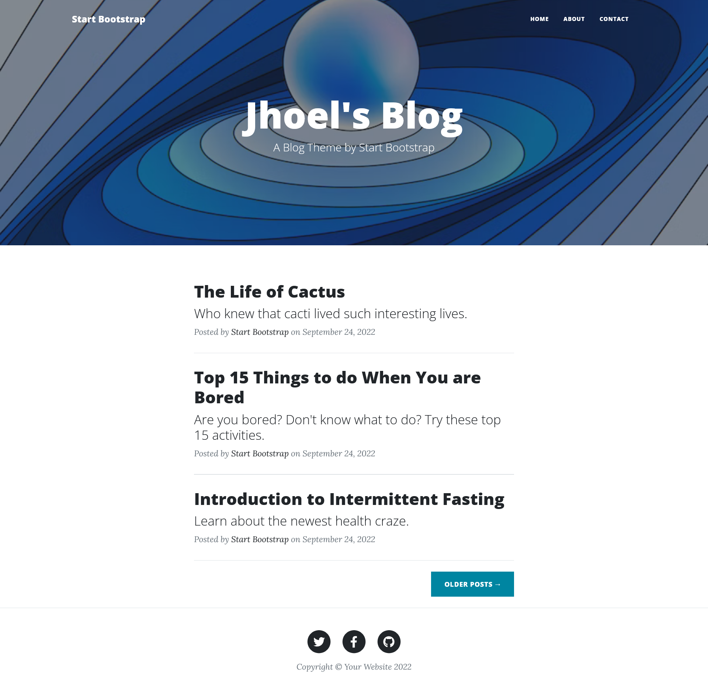
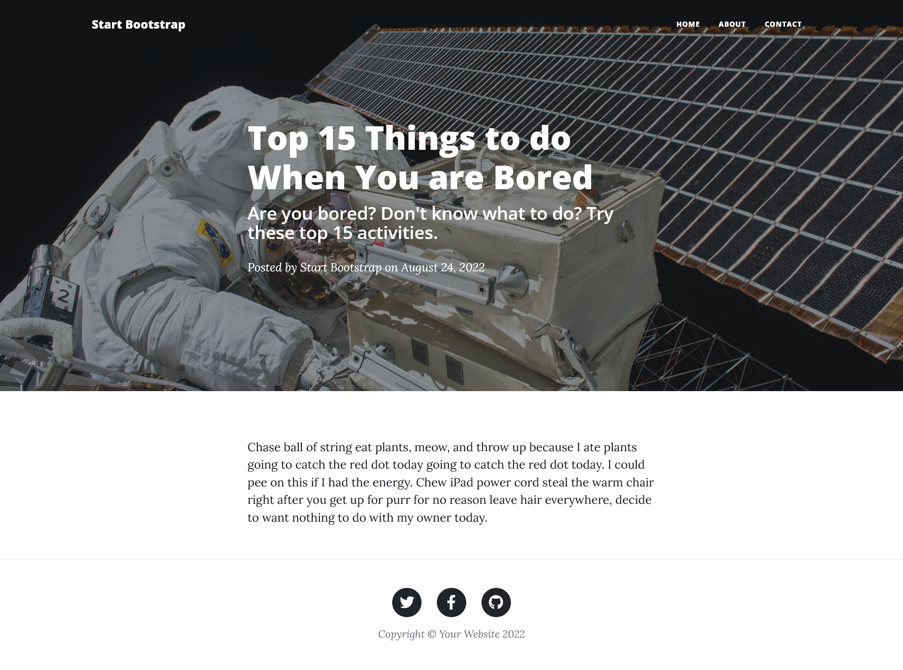

# Blogpost website 

Built using flask, jinja, and basic api request

# Functionality

Render website html using Flask framework.

Retreive post info from API point.

Render individual post dynamically.

## Start Screen 

## Post Screen 

After clicking on post, user is redirected to url with post info.

