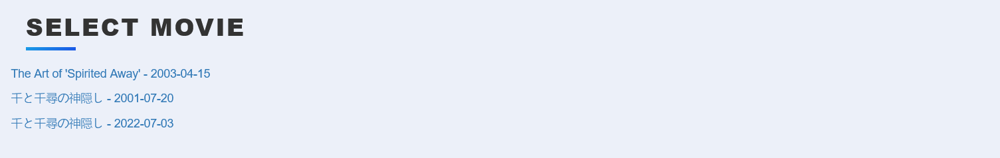

## Top 10 Movie Website 

Built using Flask, FlaskForms, SQLAlchemy and Bootstrap, the TMDB API.

# Functionality

CRUD Website displays movies on database

Uses The Movies Data Base API for information about movies

## Start Screen 

Display of movies on local db sorted by current ranking.

## Movie Element 

Thew Movie element display poster of movie, and on hover switched to View with rating, review and description of the movie. 

## Update & Delete Movie

All movies visible can be deleted from db or updated.

On Update user would be prompted to reenter renking and review of movie, which would be re-written on database.

## Add Movie

After clicking on the "Add Movie" button, user is redirected to url to input title of Movie.

The user is presented with a wide range of options matching the user's movie title (TMDB API), user can select among many results:

When user clicks the desired movie, it redirects to the edit url for user to place the ranking and review of the movie.

Once done the new movie is available on the Front Page.

